  

 

`$ ./connect --all`

---

`[madhavendranath@arch ~]$ cat about.md`

Third-year B.Tech student in **AI & Data Science at IIIT Kottayam**, working on machine learning, web development and systems engineering. Co-author on a published research paper in *Biomedical Physics & Engineering Express* (2025) on temporal patient trajectory modelling using LSTM autoencoders on EHR data.

I like building things that are technically interesting end-to-end — from RAG pipelines with hybrid retrieval and cross-encoder re-ranking, to LSTM-based portfolio optimisers with custom Sharpe-ratio losses, to compiler/linker projects in C and Rust.

`[madhavendranath@arch ~]$ cat current.log`

- Building RAG systems with hybrid retrieval (pgvector + BM25), RRF, and cross-encoder re-ranking
- Deep-learning-based portfolio optimisation (PyTorch, LSTM, FinBERT)
- Systems projects — an ELF static linker and an LLVM-based mini C compiler targeting NVPTX
- Healthcare ML research on longitudinal EHR data (MIMIC-IV)
- Production full-stack apps with Next.js, FastAPI, and PostgreSQL

---

`[madhavendranath@arch ~]$ cat stack.md`

`// ai · ml · data`

`// languages`

`// backend · infra`

`// frontend`

`// databases`

`// mobile`

---

`[madhavendranath@arch ~]$ cat responsibilities.md`

- **Machine Learning & Research:** Published research in healthcare ML; building models on time-series, NLP, and computer vision tasks with PyTorch and scikit-learn.
- **Retrieval-Augmented AI:** Production RAG pipelines with dense + sparse hybrid retrieval, Reciprocal Rank Fusion, cross-encoder re-ranking, and citation-grounded generation.
- **Quantitative Development:** Deep-learning models for portfolio optimisation and trading research — custom losses (Differential Sharpe Ratio), walk-forward backtesting, CVaR constraints.
- **Full-Stack Engineering:** End-to-end apps with Next.js, FastAPI, and PostgreSQL — from schema design to deployment.
- **Systems & Compilers:** Exploring low-level work — ELF linkers, LLVM-based compilers, NVPTX code generation.

---

`[madhavendranath@arch ~]$ top-langs --username madhav-000-s`

---

`[madhavendranath@arch ~]$ git trophy --username madhav-000-s`

---

`[madhavendranath@arch ~]$ ./connect --help`

Open to **internships**, **research collaborations**, and **quant / ML / SWE opportunities**.

